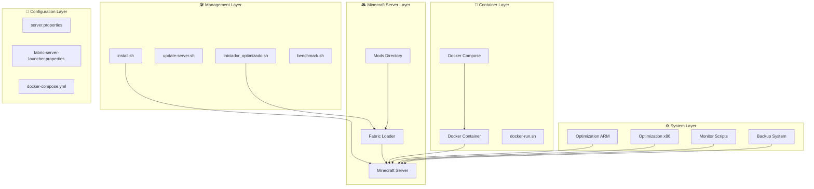
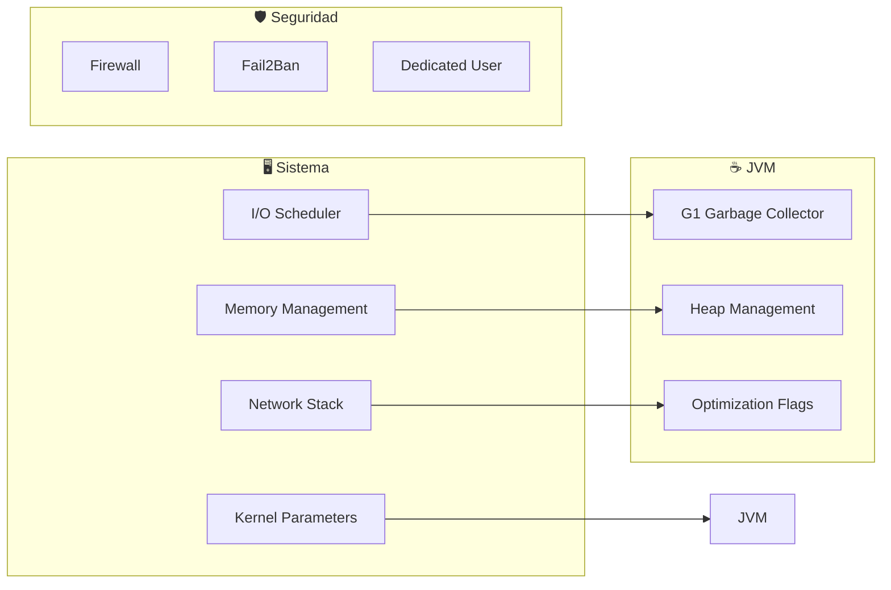
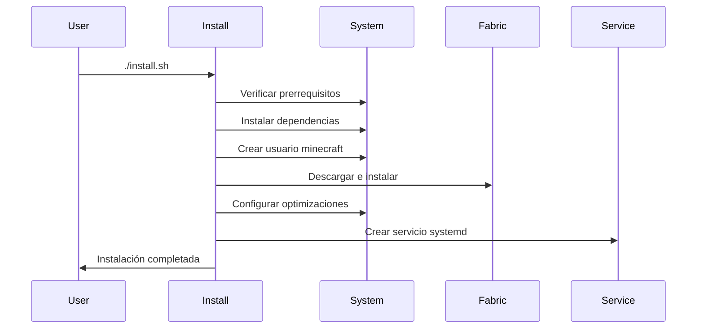
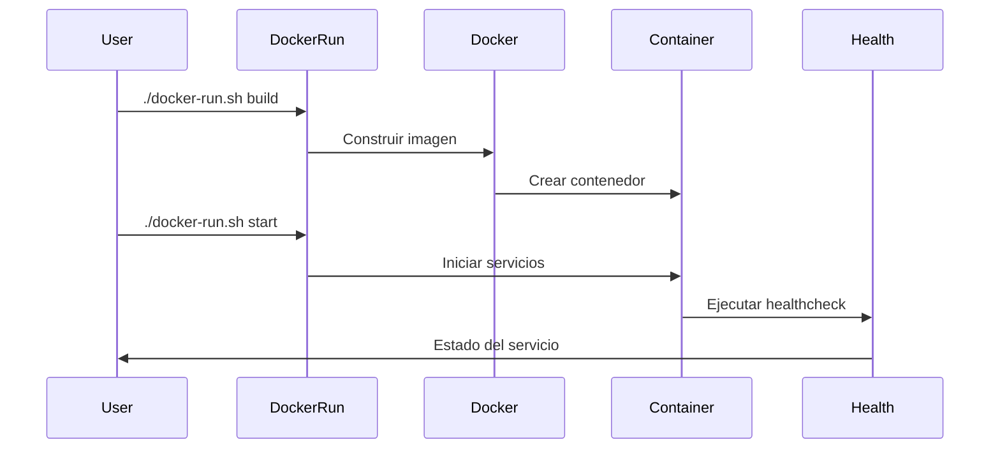
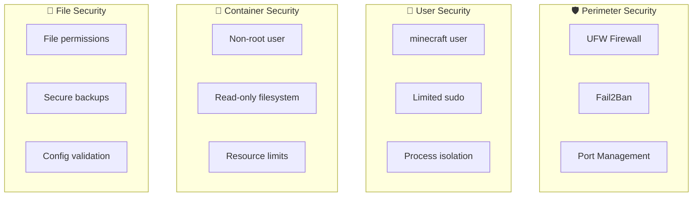
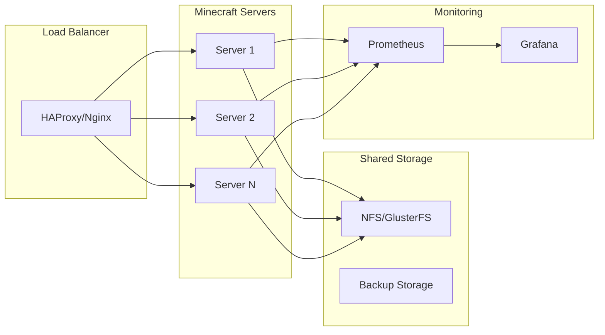

# 🏗️ Arquitectura del Sistema

Este documento describe la arquitectura completa de BuildFabricModServer, incluyendo componentes, flujos de datos y decisiones de diseño.

## 📋 Tabla de Contenidos

- [Visión General](#-visión-general)
- [Componentes Principales](#-componentes-principales)
- [Flujos de Instalación](#-flujos-de-instalación)
- [Arquitectura Docker](#-arquitectura-docker)
- [Sistema de Optimización](#-sistema-de-optimización)
- [Monitoreo y Observabilidad](#-monitoreo-y-observabilidad)
- [Seguridad](#-seguridad)
- [Escalabilidad](#-escalabilidad)

## 🎯 Visión General

BuildFabricModServer está diseñado como una solución completa para el despliegue y gestión de servidores Minecraft Fabric optimizados. La arquitectura sigue principios de:

- **Modularidad**: Componentes independientes y reutilizables
- **Portabilidad**: Soporte multi-arquitectura (x86_64, ARM64)
- **Automatización**: Instalación y gestión automatizada
- **Observabilidad**: Monitoreo y logging completo
- **Seguridad**: Configuraciones seguras por defecto



## 🧩 Componentes Principales

### 1. Scripts de Gestión

#### `install.sh` - Instalador Principal
```bash
# Flujo de instalación
Verificar prerrequisitos
├── Detectar arquitectura
├── Instalar dependencias
├── Crear usuario minecraft
├── Descargar Fabric
├── Configurar servicios
└── Generar configuraciones
```

**Funcionalidades:**
- Detección automática de arquitectura
- Instalación de dependencias
- Configuración de usuario dedicado
- Descarga automática de Fabric y Fabric API
- Creación de servicio systemd
- Configuraciones de seguridad básicas

#### `update-server.sh` - Sistema de Actualización
```bash
# Flujo de actualización
Detener servidor
├── Crear backup
├── Descargar nuevas versiones
├── Actualizar configuraciones
├── Validar instalación
└── Reiniciar servidor
```

**Funcionalidades:**
- Backups automáticos antes de actualizar
- Actualización segura de Minecraft y Fabric
- Verificación de compatibilidad de mods
- Rollback automático en caso de error
- Limpieza de archivos antiguos

#### `iniciador_optimizado_de_minecraft.sh` - Launcher Optimizado
```bash
# Optimizaciones JVM
G1 Garbage Collector
├── Configuración automática de RAM
├── Flags de Aikar optimizados
├── Detección de arquitectura
├── Logging estructurado
└── Manejo de errores robusto
```

**Características:**
- Detección automática de RAM disponible
- Flags JVM optimizados por arquitectura
- Sistema de logging con colores
- Verificaciones de integridad
- Script de emergencia automático

### 2. Sistema de Optimización

#### Optimización por Arquitectura

**ARM (Raspberry Pi, servidores ARM):**
```bash
# script_optimizacion_debian_11_ARM.sh
Optimizaciones específicas ARM
├── Configuración de scheduler
├── Ajustes de memoria para sistemas limitados
├── Red optimizada para menos cores
├── Servicios innecesarios deshabilitados
└── Swap configurado inteligentemente
```

**x86/x64 (PC, servidores tradicionales):**
```bash
# script_optimizacion_debian_11_x86-x86_64.sh
Optimizaciones específicas x86/x64
├── CPUfreq y IRQ balancing
├── Hugepages para JVM
├── Optimizaciones de red avanzadas
├── Thermal management
└── Backups automáticos programados
```

#### Configuraciones del Sistema



### 3. Arquitectura Docker

#### Imagen Multi-Arquitectura

```dockerfile
# Estructura de la imagen
FROM openjdk:17-jdk-alpine
├── Usuario no-root (minecraft)
├── Fabric Server instalado
├── Scripts de gestión
├── Healthcheck integrado
└── Configuraciones optimizadas
```

#### Servicios en Docker Compose

```yaml
# docker-compose.yml - Servicios
minecraft-server:     # Servidor principal
├── Configuración de recursos
├── Volúmenes persistentes
├── Variables de entorno
└── Healthcheck

minecraft-backup:     # Servicio de backup
├── Backups automáticos
├── Retención configurable
└── Programación flexible

minecraft-monitor:    # Monitoreo
├── Logs de estado
├── Métricas de rendimiento
└── Alertas básicas
```

## 🔄 Flujos de Instalación

### Instalación Tradicional



### Instalación Docker



## 📊 Sistema de Monitoreo

### Benchmarking y Métricas

```bash
# benchmark.sh - Suite de pruebas
Sistema
├── CPU: Pruebas de cálculo intensivo
├── Memoria: Velocidad y asignación
├── Red: Conectividad y throughput
├── Java: Rendimiento JVM
├── Minecraft: Específico del servidor
└── Estrés: Pruebas de límites
```

#### Métricas Recopiladas

| Componente | Métricas | Frecuencia |
|------------|----------|------------|
| CPU | Uso, Load Average, Temperatura | 30s |
| Memoria | Uso, Cache, Swap | 30s |
| Red | Throughput, Latencia, Conexiones | 60s |
| Disco | I/O, Espacio, Fragmentación | 300s |
| JVM | Heap, GC, Threads | 60s |
| Minecraft | TPS, Jugadores, Chunks | 60s |

### Scripts de Monitoreo

```bash
# monitor.sh - Generado por scripts de optimización
Estado del Sistema
├── Información de hardware
├── Procesos Java activos
├── Uso de recursos
├── Conexiones de red
├── Logs recientes
└── Temperatura (si disponible)
```

## 🔐 Seguridad

### Configuraciones de Seguridad



#### Medidas de Seguridad Implementadas

1. **Firewall (UFW)**
   - Solo puertos necesarios abiertos
   - Rate limiting para SSH
   - Logging de conexiones

2. **Fail2Ban**
   - Protección contra brute force
   - Configuración específica para Minecraft
   - Baneos automáticos

3. **Usuario Dedicado**
   - Usuario `minecraft` no-root
   - Permisos mínimos necesarios
   - Aislamiento de procesos

4. **Contenedores**
   - Imágenes sin vulnerabilidades críticas
   - Usuario no-root dentro del contenedor
   - Recursos limitados

## 📈 Escalabilidad

### Escalabilidad Horizontal



### Consideraciones de Escalabilidad

1. **Vertical (Scale Up)**
   - Configuración automática de RAM
   - CPU cores detection
   - Optimizaciones específicas por hardware

2. **Horizontal (Scale Out)**
   - Múltiples instancias con Docker
   - Load balancing con BungeeCord
   - Almacenamiento compartido

3. **Geografica**
   - Múltiples regiones
   - CDN para assets
   - Latencia optimizada

## 🔧 Configuraciones Avanzadas

### Variables de Entorno

| Variable | Descripción | Valor por Defecto |
|----------|-------------|-------------------|
| `MINECRAFT_VERSION` | Versión de Minecraft | 1.20.4 |
| `FABRIC_VERSION` | Versión de Fabric | 0.15.6 |
| `MAX_PLAYERS` | Jugadores máximos | 20 |
| `SERVER_PORT` | Puerto del servidor | 25565 |
| `JAVA_OPTS` | Opciones JVM | Auto-detectado |
| `BACKUP_RETENTION` | Días de retención | 7 |

### Puntos de Extensión

1. **Hooks de Scripts**
   - Pre/post instalación
   - Pre/post actualización
   - Pre/post inicio

2. **Configuraciones Personalizadas**
   - Templates modificables
   - Variables de entorno
   - Archivos de configuración

3. **Plugins de Monitoreo**
   - Métricas personalizadas
   - Alertas configurables
   - Integración con sistemas externos

## 📝 Notas de Implementación

### Decisiones de Diseño

1. **Shell Scripts vs Python/Go**
   - Elegimos Bash por simplicidad y disponibilidad universal
   - Menor overhead para scripts de sistema
   - Mejor integración con herramientas del sistema

2. **Docker Multi-Stage vs Single Stage**
   - Single stage para simplicidad
   - Optimización de tamaño con Alpine
   - Mejor debuggability

3. **SystemD vs Docker para Gestión**
   - Ambos soportados
   - SystemD para instalaciones tradicionales
   - Docker para portabilidad y aislamiento

### Limitaciones Conocidas

1. **Arquitecturas Soportadas**
   - Actualmente: x86_64, ARM64
   - No soportado: ARMv7, RISC-V

2. **Sistemas Operativos**
   - Debian/Ubuntu principalmente
   - Otros sistemas requieren adaptación

3. **Versiones de Java**
   - Optimizado para Java 17+
   - Versiones anteriores no recomendadas

### Roadmap Técnico

1. **Corto Plazo**
   - Métricas avanzadas con Prometheus
   - Integración con Grafana
   - API REST para gestión

2. **Mediano Plazo**
   - Soporte para más distribuciones
   - Clustering automático
   - Machine learning para optimización

3. **Largo Plazo**
   - Edge computing support
   - Kubernetes operator
   - Multi-cloud deployment